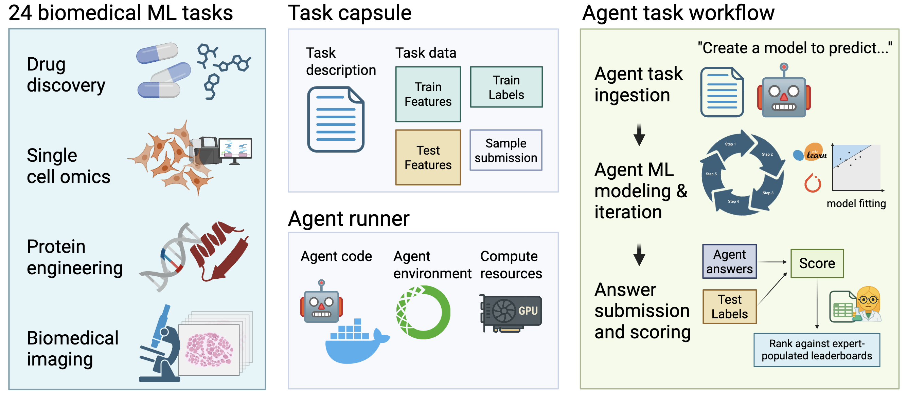

# BioML-bench (v0.1-alpha)

**Note: This is a pre-release version of BioML-bench. Expect bugs and incomplete features.**

A benchmark suite for evaluating LLM agents on biomedical machine learning tasks.



**📄 Paper**: [BioML-bench: Evaluation of AI Agents for End-to-End Biomedical ML](https://www.biorxiv.org/content/10.1101/2025.09.01.673319v2)

BioML-bench is built on top of [MLE-bench](https://github.com/openai/mle-bench) and provides a comprehensive framework for benchmarking LLM agents on biomedical machine learning tasks including protein engineering, drug discovery, single cell omics, medical imaging, and clinical biomarkers.

Agents autonomously read task descriptions, analyze biomedical data, design appropriate ML approaches, and implement complete solutions from scratch.

## 🧬 Key Features

- **🔬 Diverse Biomedical Tasks**: Protein engineering, drug discovery, single cell omics, medical imaging, clinical biomarkers
- **🤖 Agent-Agnostic Evaluation**: Any LLM agent that can read task descriptions and produce file/folder submissions can be evaluated
- **👨‍⚕️ Human Baselines**: Built-in human performance benchmarks for comparison  
- **🔒 Secure Evaluation**: Containerized execution with no data leakage
- **🔧 Extensible Framework**: Easy to add new biomedical tasks
- **📚 Biomedical Libraries**: Pre-installed RDKit, BioPython, and other domain-specific tools

## 🚀 Quick Start

### Prerequisites

- **Python 3.11+**
- **Docker** - For containerized agent execution
- **uv** - Python package manager ([installation guide](https://docs.astral.sh/uv/))

### Installation

```bash
# Clone the repository
git clone https://github.com/science-machine/biomlbench.git
cd biomlbench

# Install with uv (recommended)
uv sync

# Activate the environment
source .venv/bin/activate  # Linux/macOS
# or .venv\Scripts\activate  # Windows
```

### Basic Usage

```bash
# 1. Prepare a task dataset
biomlbench prepare -t polarishub/tdcommons-caco2-wang

# 2. Run an agent (example with dummy agent)
biomlbench run-agent --agent dummy --task-id polarishub/tdcommons-caco2-wang

# 3. Grade the results
biomlbench grade --submission <run-group-dir>/submission.jsonl --output-dir results/
```

## 🤖 Available Agents

- **dummy** - Testing agent that returns null predictions
- **aide** - Advanced agent using OpenAI's API (requires API key)  
- **biomni** - Biomedical multi-modal agent
- **stella** - Specialized biomedical reasoning agent
- **mlagentbench** - MLE-bench compatibility agent

## 📊 Example Tasks

### Medical Imaging
- **manual/histopathologic-cancer-detection**: Cancer detection in histopathology patches

### Drug Discovery  
- **polarishub/tdcommons-caco2-wang**: Molecular property prediction (intestinal permeability)


## 📚 Documentation

- **[📖 Full Documentation](http://biomlbench-docs.s3-website-us-west-2.amazonaws.com/)** - Complete guides and API reference
- **[⚙️ Installation Guide](http://biomlbench-docs.s3-website-us-west-2.amazonaws.com/installation/)** - Detailed setup instructions
- **[📝 Usage Guide](http://biomlbench-docs.s3-website-us-west-2.amazonaws.com/usage/)** - Comprehensive usage examples
- **[🏗️ API Reference](http://biomlbench-docs.s3-website-us-west-2.amazonaws.com/api/)** - Complete API documentation  
- **[🛠️ Developer Guide](http://biomlbench-docs.s3-website-us-west-2.amazonaws.com/developer/)** - Extending and contributing

## 🤝 Contributing

We welcome contributions! See our [Contributing Guide](http://biomlbench-docs.s3-website-us-west-2.amazonaws.com/developer/contributing/) for details on:

- Adding new biomedical tasks
- Creating custom agents  
- Extending data sources
- Improving documentation

## 📄 Citation

If you use BioML-bench in your research, please cite our paper:

```bibtex
@article{biomlbench2025,
  title={BioML-bench: Evaluation of AI Agents for End-to-End Biomedical ML},
  author={[Authors]},
  journal={bioRxiv},
  year={2025},
  doi={10.1101/2025.09.01.673319},
  url={https://www.biorxiv.org/content/10.1101/2025.09.01.673319v2}
}
```

